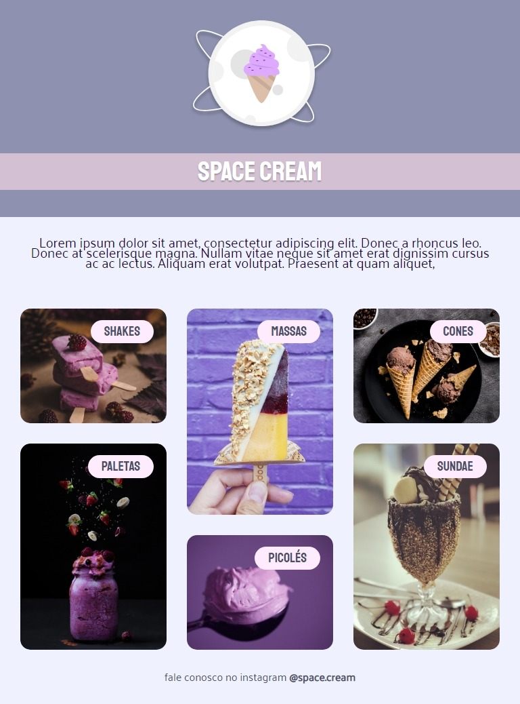
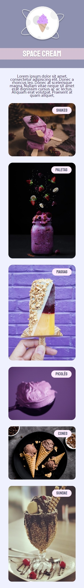
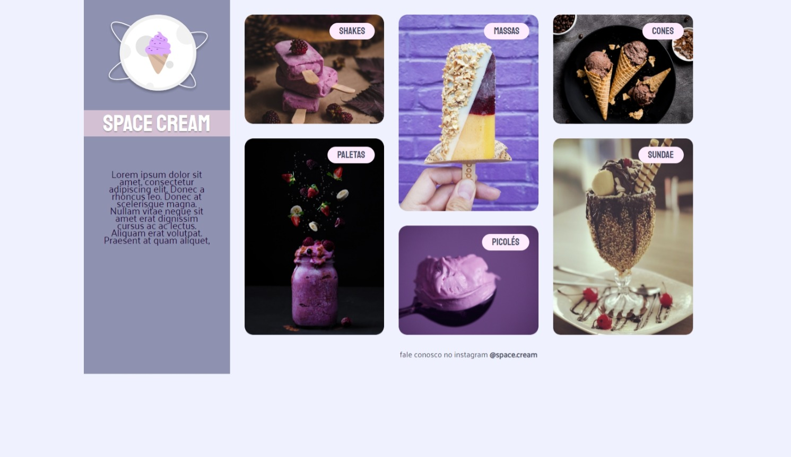

<h1 align="center"> Stage03-Challenge 04  Space Cream Desktop </h1>

  <a href="#-technologies">Technologies</a>&nbsp;&nbsp;&nbsp;|&nbsp;&nbsp;&nbsp;
  <a href="#-project">Project</a>&nbsp;&nbsp;&nbsp;|&nbsp;&nbsp;&nbsp;
  <a href="#-layout">Layout</a>&nbsp;&nbsp;&nbsp;|&nbsp;&nbsp;&nbsp;
  <a href="#memo-license">License</a>

  

 
  

    
  
    

## 🚀 Technologies

This project was developed with the following technologies:

- HTML 
- CSS
- Git e Github
- Figma

## 💻 Project

  Challenge 04 is a creation of a basic Landing-Page to strengthen our knowledge about some concepts learned in class at Rocketseat, including:

  <ul>
  <li>Display Grid</li>
  <li>Flexible Unit of Measure</li>
  <li>Variables</li>
  <li>Animations</li>
  <li>Transitions and Transformations</li>
  <li>Media Queries</li>
  <li>Fitting the Image and Overlapping the Text</li>
  <li>Adjusting texts with css clamp</li>

  </ul>
      
 

- [Visit the project online](https://esioalmeida.github.io/Stage-03-Desafio-04-Space-Cream-Desktop/)

 

## 🔖 Layout

You can view the layout of the project through [FROM THIS LINK](https://www.figma.com/file/OlwuDcs18fmlvXQNi6zand/Stage-03---Grid-com-anima%C3%A7%C3%B5es-(Copy)). Must have an account on the [Figma](https://figma.com) to access it. 

  

## :memo:  License

This project is licensed under the MIT license.

---

Made with ♥ by Esio Almeida :wave: [Join the RocketSeat community!](https://discord.gg/rocketseat)
